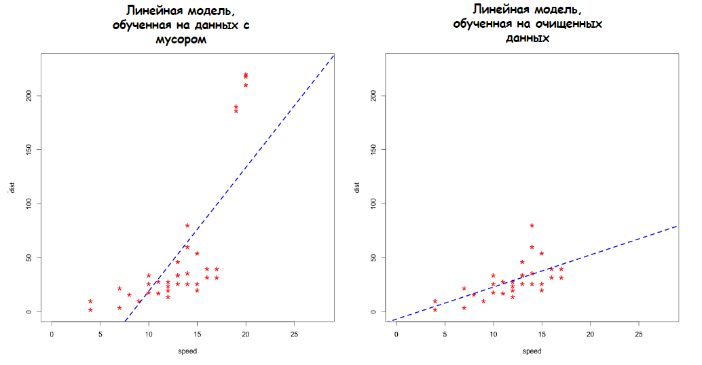

# <center> Cleaning data on Python </center>
## Contents
1. [Project description](#Project-description)
2. [Описание данных](#Описание-данных)
3. [Зависимости](#Зависимости)
4. [Установка проекта](#Установка-проекта)
5. [Использование проекта](#Использование-проекта)
6. [Авторы](#Авторы)
7. [Выводы](Использование-проекта)

## Project description

> **Data cleaning** -it's process of detection and drop (to improve) broked, fake or noninformative table or comlete database. Process there are 2 stages: search and liquidation (or improve).


Main stage of data cleaning:
* Work with missing values.
* Cleaning data from missing data.
* Drop noninformative signs and records.

**Purpose data cleaning** — 
Drop "trash", that can interfere with the simulation or distort his result. In many tasks data cleaning - this is main part of stage of preparation data to build a model. 
For that need a lot of time to work.

Look at axample of means of "Trash" on result. On grathics display two scatter diagrams and two same line models (straight, that try repeat data). On left chart model build
on "dirty" data, containing anomalies, and of right chart model teach on clean data.



**Данный проект** направлен на демонстрацию применения различных методов очистки данных на каждом из ее этапов на примере датасета о квартирах в Москве от Сбербанка.

**О структуре проекта:**
* [data](./data) - папка с исходными табличными данными
* [images](./images) - папка с изображениями, необходимыми для проекта
* [outliers_lib](./outliers_lib) - папка со вспомогательными модулями для обработки выбросов 
* [data_cleaning_example.ipynb](./data_cleaning_example.ipynb) - jupyter-ноутбук, содержащий основной код проекта, в котором демонстрируются методы и подходы решения задач очистки данных


## Описание данных
В этом проекте используются данные с соревнования [Sberbank Russian Housing Market](https://www.kaggle.com/c/sberbank-russian-housing-market/data) от Сбера (бывш. Сбербанк).

Требования Сбера состояли в построении модели, которая бы прогнозировала цены на жильё в Москве, опираясь на параметры самого жилья, а также состояние экономики и финансового сектора в стране.

Исходный датасет представляет собой набор данных из таблицы с информацией о параметрах жилья в Москве и Московской области, а также таблицы, в которой содержатся 292 признака о состоянии экономики России на момент продажи недвижимости. 

Для упрощения демонстрации техники очистки данных мы будем отрабатывать на урезанном датасете. Он содержит информацию о 61 признаке, описывающих жилье. Файл с данными можно найти [здесь](./data/sber_data.csv).

## Используемые зависимости
* Python (3.9):
    * [numpy (1.20.3)](https://numpy.org)
    * [pandas (1.3.4)](https://pandas.pydata.org)
    * [matplotlib (3.4.3)](https://matplotlib.org)
    * [seaborn (0.11.2)](https://seaborn.pydata.org)

## Установка проекта

```
git clone https://github.com/SkillfactoryDS/DataCleaningProject
```

## Использование
Вся информация о работе представлена в jupyter-ноутбуке data_cleaning_example.ipynb.

## Авторы

* [Укажите свое имя](ссылка на ваши соц сети)

## Выводы

Допишите выводы по проделанной работе.